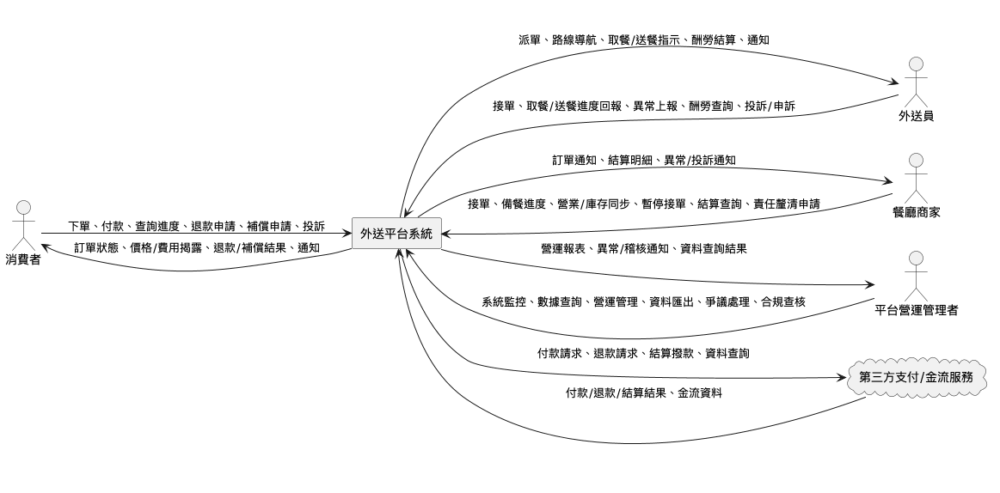

# Draft

## Scope

### In Scope
- 提供消費者、外送員、餐廳商家及平台營運管理者使用的外送平台系統，涵蓋訂單處理、付款、配送進度查詢、即時協助與爭議處理等主要流程。
- 支援多角色（消費者、外送員、餐廳商家、平台營運管理者）之操作介面與資訊呈現，並確保各角色可取得其所需之功能與資訊。
- 管理與同步訂單、商品、庫存、營業時間、配送資訊及相關費用，並確保資料正確性與透明度。
- 提供金流結算、酬勞與撥款管理，並符合法規要求之稅務與合規作業。
- 支援平台內部與外部（如商家、外送員、消費者）之溝通協作與爭議處理機制。

## User Requirements
| ID | Stakeholder | Requirement | Source |
|---|---|---|---|
| URL-1 | 消費者 | 消費者需要一個操作流程簡單、選餐、付款與訂單進度查詢皆清楚明瞭的外送平台，以提升使用意願。 | initial |
| URL-2 | 消費者 | 消費者需要外送平台具備即時協助與便捷的退款流程，以提升服務可靠性並有效處理出餐延遲或外送員服務不佳等問題。 | initial |
| URL-3 | 消費者 | 消費者需要外送平台能夠透明公開所有商品價格及相關費用（如運費、服務費），避免於結帳流程中出現未事先告知的額外費用，以提升價格透明度與消費信任 | R1-M1 |
| URL-4 | 消費者 | 消費者需要外送平台在外送過程中若發生食物傾倒、送錯或餐點變冷等問題時，能夠提供明確的賠償或處理機制。 | initial |
| URL-5 | 消費者 | 消費者需要能夠即時查詢外送訂單的預計送達時間，以便根據外送進度決定是否繼續使用平台服務。 | initial |
| URL-6 | 外送員 | 外送員需要外送平台具備順暢且不會出錯的地圖導航與取餐流程，並確保系統運作速度與資訊正確性，以提升每日可完成的訂單數量。 | initial |
| URL-7 | 外送員 | 外送員需要平台能夠公平處理惡意投訴及出餐延遲等爭議，並提供適當的保護機制。 | initial |
| URL-8 | 外送員 | 外送員需要外送平台能夠標註無法進入的超商或社區，或提供相關聯絡方式，以減少因無法完成配送而浪費時間。 | initial |
| URL-9 | 外送員 | 外送員需要外送平台能夠準確且依固定週期結算酬勞，並避免產生酬勞扣款或計算錯誤的情形，以維持合作意願。 | initial |
| URL-10 | 外送員 | 外送員需要外送平台合理分配訂單，避免派單數量過少或集中特定外送員，以確保派案制度的公平性 | R1-M1 |
| URL-11 | 平台營運管理者 | 平台營運管理者需要系統具備穩定性與可靠性，避免頻繁當機或出錯，以維護用戶留存與品牌形象。 | initial |
| URL-12 | 平台營運管理者 | 平台營運管理者需要能即時查看分析數據、訂單流量、營收與異常狀況，以便隨時調整行銷策略或處理緊急問題。 | initial |
| URL-13 | 平台營運管理者 | 平台營運管理者需要平台具備順暢且有效的與商家及外送員溝通渠道，以避免因溝通不良導致問題堆積並增加客服壓力。 | initial |
| URL-14 | 平台營運管理者 | 平台營運管理者需要平台在金流與稅務相關作業上完全符合法規要求，以避免因違規導致的罰款風險，並維護公司合規底線。 | initial |
| URL-15 | 平台營運管理者 | 平台營運管理者需要系統的功能與費用設計能在吸引消費者、照顧外送員權益和維持平台收入三者之間取得平衡 | R1-M1 |
| URL-16 | 餐廳商家 | 餐廳商家需要一個操作介面簡單且便於管理的系統，能夠明確呈現訂單資訊並自動與庫存及營業時間同步，以降低員工操作錯誤的風險。 | initial |
| URL-17 | 餐廳商家 | 餐廳商家需要平台能夠協助釐清消費者投訴或外送員遲到等責任歸屬，以避免商家在無法合理判斷責任時單方面承擔損失。 | initial |
| URL-18 | 餐廳商家 | 餐廳商家需要平台能夠準時結算撥款並清楚呈現結算明細，以確保商家收款流程的透明與信任，並避免出現延遲結帳或無預警扣款的情形。 | initial |
| URL-19 | 餐廳商家 | 餐廳商家需要平台收取的手續費維持在合理範圍，以確保商家在薄利多銷情境下仍能獲利並維持續約及持續上架意願 | R1-M1 |
| URL-20 | 餐廳商家 | 餐廳商家需要能即時暫停接單，以避免因食材短缺或臨時公休造成無法完成的訂單。 | initial |
| URL-21 | 消費者 | 消費者需要能夠在每次訂餐時自由選擇取餐地點與接收方式，並可於平台介面彈性補充取餐相關指示或注意事項，且外送員能確實收到這些資訊，以因應不同生活情境下的需求 | R1-M1 |
| URL-22 | 消費者 | 消費者需要平台在設定取餐方式時，必須事先明確告知並讓消費者確認，避免自動決定或更改取餐方式而未經消費者同意。 | elicitation_r1 |
| URL-23 | 平台營運管理者 | 平台營運管理者需要系統能夠依據不同國家或合作內容，保存金流與交易資料達到法規及商業合約所要求的年限，並確保資料於稽核或查核時可立即提供完整且不可被修改的原始紀錄。 | elicitation_r1 |
| URL-24 | 平台營運管理者 | 平台營運管理者需要系統能夠支援金流與交易資料以便於審查的格式匯出，例如csv、pdf或API調用，以利營運管理與稽核作業。 | elicitation_r1 |
| URL-25 | 外送員 | 外送員需要能夠在遇到餐廳未營業或備餐延遲等異常情況時，於平台上快速上報並獲得明確的後續處理指引，以減少現場等待與不確定感，並確保派單量與收入不因異常事件受到不公平影響 | R1-M1 |
| URL-26 | 消費者 | 消費者需要外送平台在補充取餐地點或接收方式等指示後，能夠明確回饋外送員已讀取並確認相關訊息，以提升資訊傳遞的可靠性與消費者安心感 | R1-M1 |
| URL-27 | 平台營運管理者 | 平台營運管理者需要外送平台在消費者指定非住家地點（如公司、超商、公共空間等）作為取餐地點時，能明確揭露相關風險與責任，並於必要時要求消費者在下單前確認同意條款、說明進出規則或提供聯絡協助，且若場域需要特別同意，平台必須能查驗消費者權限或留存同意證明，以避免平台承擔無法控管的糾紛責任 | R1-M1 |
| URL-28 | 外送員 | 外送員需要外送平台在接單後及接近目的地前，能夠明顯且即時提醒取餐或送餐的特殊指示，並確保相關內容不被隱藏，方便外送員在配送過程中即時掌握消費者的臨時留言或變更資訊 | R1-M1 |
| URL-29 | 消費者 | 消費者需要外送平台在外送員未依照已讀的取餐指示完成時，能主動通知消費者、提供外送員說明未能配合原因的機會，並協助消費者了解狀況與處理流程，若無合理理由未配合時，平台需有具體補償機制以保障消費者權益 | R1-M1 |
| URL-30 | 平台營運管理者 | 平台營運管理者需要外送平台在涉及特殊或高風險取餐地點時，具備要求消費者每次下單時主動確認並說明進出權限及特殊指示、必要時上傳門禁資訊或臨時聯絡人，並留存消費者同意證據，以降低營運風險並能於主管機關或消費申訴時佐證平台已盡責 | R1-M1 |
| URL-31 | 外送員 | 外送員需要外送平台在送餐流程的每個關鍵步驟提供明顯且不易忽略的提醒，並確保重要訊息不會被隱藏於多層選單或頁面中，以降低資訊遺漏風險 | R1-M1 |
| URL-32 | 外送員 | 外送員需要外送平台在有風險或重要變動時，能以明確且易於理解的方式提醒相關內容，讓外送員能立即得知並正確應對。 | elicitation_r1 |
| URL-33 | 外送員 | 外送員需要外送平台的提醒功能不會妨礙導航、問題回報等其他重要操作，避免因提醒訊息導致操作誤觸或流程中斷 | R1-M1 |
| URL-34 | 消費者 | 消費者在外送員未依照補充取餐指示導致問題時，需要能夠於平台上簡單快速地選擇退款或等值補償（如折價券、平台點數），且補償金額需合理反映實際損失，並可依個人偏好選擇補償方式 | R1-M1 |
| URL-35 | 消費者 | 消費者在遇到外送過程中無法聯絡外送員或現場發生特殊問題等複雜情境時，需要平台主動提供客服協助，避免需自行多次追問處理進度。 | elicitation_r1 |
| URL-36 | 平台營運管理者 | 平台營運管理者需要系統在消費者指定特殊取餐地點（如校園、醫院、商辦大樓等）時，能夠揭露該地點的進出限制或隱私規範，並要求消費者在下單前明確同意相關風險與現場規則，必要時提供臨時聯絡人或門禁資料，並保留同意紀錄，以確保平台不被推定為現場配送問題的唯一責任方 | R1-M1 |
| URL-37 | 外送員 | 外送員在無法依照消費者補充指示完成配送或現場遇到突發狀況時，需要外送平台提供簡單明確且可快速操作的回報與協助流程，包含常見問題選項、即時留言、消費者即時通知與回應機制，以及在消費者未回應時由平台自動或人工協助處理，並於整個過程中提供進度提醒與紀錄，確保外送員權益不受損 | R1-M1 |

## System Requirement

### REQ-1: 訂單流程簡化與透明
- Type: functional
- Priority: must
- Description: 系統應設計簡單明瞭的選餐、付款及訂單進度查詢流程，讓使用者能以最少步驟完成操作，且於各環節提供清楚指示與相關資訊，提升消費者操作意願與便利性。
- Rationale: 簡化的操作與資訊透明度能降低流失率，促使消費者提高使用頻率。
- Source: URL-1, R1-M2
- Acceptance Criteria:
  - 消費者可於30秒內完成點餐至下單流程，不需重複填入相同資訊。
  - 訂單進度查詢介面包含餐點準備、外送員取餐、配送中、即將送達等明確狀態標示。
  - 所有操作介面有明顯且易懂的指示（如按鈕名稱、提示訊息），無操作死角。

### REQ-2: 即時協助與便捷退款處理
- Type: functional
- Priority: must
- Description: 系統應於消費者遇到出餐延遲、外送員服務不佳等問題時，提供即時線上協助通道與一站式退款申請流程，並於合理時間內完成退款處理及回復查詢。
- Rationale: 即時協助與便捷退款可提升服務可靠性，及早處理問題維持消費者信任。
- Source: URL-2, R1-M2
- Acceptance Criteria:
  - 消費者可於訂單詳細頁直接發起即時協助（如線上客服、智能回復）。
  - 消費者可於三分鐘內完成退款申請，平台需於規定期限（如3個工作天內）完成初步處理及回覆。
  - 系統自動保留協助及退款申請紀錄，供雙方查詢。

### REQ-3: 價格及費用資訊揭露規範
- Type: constraint
- Description: 系統介面必須明確揭示所有商品價格、各項服務費與運費，並完整列出各種取消訂單之理由及對應退費機制，不得有未公開的額外費用，並需符合地方法規與主管機關規定。
- Rationale: 強制資訊揭露可避免消費糾紛並符合法規，提升平台信任及法遵風險管理。
- Source: URL-3, R1-M2
- Acceptance Criteria:
  - 消費者於結帳前可一覽所有金額明細與必要費用。
  - 無提前揭露之額外費用，不得於結帳時臨時新增未說明之費用項目。
  - 取消訂單介面提供各種理由選項與其退費標準規則說明。

### REQ-4: 訂單異常賠償及處理機制
- Type: functional
- Priority: must
- Description: 系統應建立於外送過程中發生餐點傾倒、送錯、餐點變冷等異常時的回報入口，提供消費者明確的賠償標準與自動、人工處理機制，並保留所有相關證據與處理日誌。
- Rationale: 明確的賠償處理機制可減少爭議，增強消費者對平台保障的信任度。
- Source: URL-4, R1-M2
- Acceptance Criteria:
  - 消費者可於訂單異常事件發生後，三分鐘內於平台完成回報。
  - 平台系統自動依事件類型推算及提醒可申請之賠償方式及標準。
  - 後台具處理紀錄、證據保存及申訴調查流程，方便主管機關稽核。

### REQ-5: 外送訂單預計送達時間查詢
- Type: functional
- Priority: must
- Description: 系統應於訂單成立後即時顯示預計送達時間於消費者介面，並根據配送進度自動更新此時間，協助消費者掌握外送狀態並決定是否使用平台服務。
- Rationale: 預計送達時間資訊有助於消費決策，並當配送異常時可及時調整預期與減少抱怨。
- Source: URL-5, R1-M2
- Acceptance Criteria:
  - 訂單成立後即刻於消費者查詢頁顯示預計送達時間。
  - 送達時間根據外送進度動態更新（如交通、天氣、異常事件等）且更新頻率明確（如每3分鐘一次）。
  - 消費者可隨時查詢歷史及即時的送達預估紀錄，且介面標示清晰。

### REQ-6: 地圖導航、取餐與配送流程支持
- Type: functional
- Priority: must
- Description: 當外送員前往餐廳或消費者地點進行取餐與配送時，系統應於同一頁面整合顯示地圖導航、取餐指示及相關配送資訊，並根據訂單狀態自動更新目的地及指示。未授權或無法進入場所時，系統應顯示聯絡資料協助外送員處理現場障礙。
- Rationale: 協助外送員流暢執行訂單、正確判讀現場指示並減少因現場障礙或路徑誤導造成送餐失敗，有效提升整體配送效率。
- Source: URL-6, URL-8
- Acceptance Criteria:
  - 外送員可於一個頁面內同時查詢導航路線、取餐指示、配送資訊及可用聯絡方式。
  - 導航指南須與訂單狀態聯動，自動調整目的地並顯示異常情境提示。
  - 導航錯誤（如導至錯誤地點）、取餐/配送指示顯示錯誤或關鍵資訊遺漏之訂單比例低於1%（以日均計算）。
- Risks:
  - 場所或聯絡資訊需合規揭露，誤用可能衍生個資風險。
- Assumptions:
  - 外送員能合法取得顧客或場域聯絡資訊以協助處理配送障礙。

### REQ-7: 系統效能與資訊正確性
- Type: non-functional
- Priority: must
- Description: 系統應維持高效的回應速度與處理能力，並確保訂單、導航及關鍵資訊的正確性和時效性，避免因為錯誤或延遲影響外送員執行訂單。此品質要求應涵蓋操作介面、地圖、報酬資料等主要系統交易範圍。
- Category: performance, reliability, accuracy
- Metric: 平均操作回應時間小於2秒；外送員每千筆訂單關鍵資訊錯誤次數不得超過1筆。
- Validation: 日常自動監控操作速度，透過測試帳號進行批次資料正確性抽查，每月審查回應時間和錯誤通報率。
- Rationale: 資訊精準且回應迅速有助於外送員穩定、高效地執行配送任務，維持服務競爭力與可靠度。
- Source: URL-6, R1-M2
- Acceptance Criteria:
  - 外送員操作關鍵畫面時，系統回應時間於2秒內完成。
  - 配送、取餐或金流資訊每日整體錯誤率於萬分之一以下，且高峰時段資訊不延遲。
  - 服務異常時，錯誤通報於5分鐘內進入管理者監控系統。
- Risks:
  - 高併發流量或外部地圖服務異常可能影響整體處理效能與資料一致性。

### REQ-8: 爭議處理與外送員保護機制
- Type: functional
- Priority: must
- Description: 系統應提供外送員針對惡意投訴或出餐延遲等爭議事件，快速提交申訴或說明之途徑，並於爭議處理過程中設計適當保護措施，以避免誤判及平台對外送員不公平待遇。
- Rationale: 防止外送員誤受處分與提升外送員對平台公平性的信任感。
- Source: URL-7
- Acceptance Criteria:
  - 外送員可於每次涉及爭議的訂單詳情頁，在3步驟內提交異議。
  - 系統於受理爭議時，暫時凍結相關懲處，待調查完成後再執行。
  - 每筆爭議案件均有處理紀錄供日後稽核與外送員查詢。
- Risks:
  - 惡意申訴濫用導致處理資源耗損。

### REQ-9: 酬勞結算與正確度管理
- Type: functional
- Priority: must
- Description: 系統應依約定週期自動結算外送員酬勞，並確保結算明細、扣款、錯誤修正流程透明，讓外送員可隨時查詢酬勞記錄與明細，避免漏發、誤扣與異常狀況。
- Rationale: 確保酬勞正確無誤，提升外送員合作意願與平台信任度。
- Source: URL-9
- Acceptance Criteria:
  - 外送員可於結算日當天查看當期酬勞明細與異常狀況說明。
  - 任何扣款項目需有明確說明與下方申訴機制連結。
  - 系統每月主動核對訂單與酬勞記錄，發現異常自動推播通知外送員。
- Risks:
  - 結算邏輯或介面設計不清將引發外送員誤解與爭議。

### REQ-10: 訂單派送公平性
- Type: functional
- Priority: must
- Description: 系統訂單派單邏輯應確保訂單分配不因外送員身份、過往紀錄或出餐異常而不公平排擠，避免訂單過度集中於特定外送員或讓部分外送員長期接單數過少，提升派案制度的公開與合理性。
- Rationale: 保障外送員收入機會，減少不公平分配造成的怨懟與申訴壓力，提升平台穩定性。
- Source: URL-10
- Acceptance Criteria:
  - 平台每週自動產出派單分配統計報表供主管查核。
  - 若發現演算法造成長期極端分配現象，系統自動產生異常提示並供人工審查介入。
  - 外送員可查閱個人歷史派單分配情況，若有爭議可發起申訴。
- Risks:
  - 演算法不透明可能引發排擠爭議及外送員信任危機。
- Assumptions:
  - 派單系統考量多元參數但不得有明顯偏袒行為。

### REQ-11: 系統穩定性與可靠性
- Type: non-functional
- Priority: must
- Description: 系統在日常營運、維運作業及高併發情境下，必須維持穩定運作，避免頻繁當機、錯誤或服務中斷，以確保用戶得以持續使用服務且不因系統異常中斷主要業務流程。
- Category: reliability, availability
- Metric: 全年平均系統可用率不低於99.9%；重大當機或無法完成主要業務功能之事件每月不得超過1次。
- Validation: 定期自動化監控系統可用率與異常日誌，並每月審核營運紀錄、事故回報件數與平均回復時間。
- Rationale: 穩定性與可靠性是維護用戶留存與品牌形象的關鍵因素，避免服務中斷損失商業機會。
- Source: URL-11
- Acceptance Criteria:
  - 全年平均可用率達99.9%以上（含維護時段）。
  - 每月因系統當機或主要功能異常造成的服務中斷不得超過1次。
  - 系統發生異常後於10分鐘內自動通報與啟動復原流程。
- Risks:
  - 高併發或關鍵維運時段遇到系統當機，將造成大量用戶流失與品牌信任危機。

### REQ-12: 營運即時數據監控與異常分析
- Type: functional
- Priority: must
- Description: 平台應提供營運管理者即時查詢分析平台數據（如訂單流量、營收、異常事件等）之能力，以支援行銷調整、緊急問題處理與經營決策，並具備異常自動告警與可追溯分析功能。
- Rationale: 即時與可追蹤的營運資訊有助於快速決策及風險管理，減少運營損失。
- Source: URL-12
- Acceptance Criteria:
  - 主管可透過專屬介面隨時查詢最新訂單流量、營收及過去30天內異常記錄。
  - 系統於訂單流量或金流異常（如超標、驟降）時能於3分鐘內自動通知管理者。
  - 所有數據異常紀錄具備完整追溯來源與查詢時間戳記。
- Risks:
  - 異常偵測失靈將造成營運風險無法即時回應。

### REQ-13: 多方溝通協作渠道
- Type: functional
- Priority: must
- Description: 平台應支援有效且順暢的溝通機制，讓營運管理者能與商家、外送員互動協調，處理平台營運相關議題，並能即時將重要訊息訊息推送給指定對象，避免因溝通不暢導致問題積壓及客服壓力增加。
- Rationale: 有效的溝通協作可即時處理提出問題、減緩客服壓力及提升運營效率。
- Source: URL-13
- Acceptance Criteria:
  - 管理者可一站式查閱並回覆外送員或商家來訊，支持主題分類與訊息查詢。
  - 平台支援雙向訊息推播機制（如公告、警示），訊息到達率達98%以上。
  - 所有溝通記錄及處理結果可追溯、具查詢與導出功能。
- Risks:
  - 溝通機制設計不良會造成處理延誤與申訴量增加。

### REQ-14: 金流與稅務合規作業
- Type: constraint
- Description: 平台處理金流及稅務等相關作業時，必須遵守所有適用法規（含第三方支付、消費者保護、個資及稅務法等），並具備自動保存、查核與稽核機制，以確保所有交易、退款、酬勞結算及相關資料均可供主管機關稽查且保存期限不低於兩年。
- Rationale: 符合法規以避免罰款風險並維護公司合規底線、保護品牌及經營資格。
- Source: URL-14
- Acceptance Criteria:
  - 所有金流與營收資料自動保存並可供查核，保存期限不低於兩年。
  - 支付流程、稅務報表與資料存取均符合台灣主管機關規範及第三方支付業者合規要求。
  - 平台發現違規事件時能自動記錄處理流程，並於法規要求期限內完成通報。
- Risks:
  - 若未符合法規要求，將面臨高額罰鍰及經營資格喪失風險。

### REQ-15: 平台功能與費用平衡性
- Type: non-functional
- Priority: must
- Description: 系統整體設計須兼顧吸引消費者、保障外送員權益及維持平台營收三方利益間的平衡，避免任一方因費用規劃失衡而影響服務持續性與合作意願。
- Category: usability, maintainability, economic efficiency
- Metric: 消費者回饋因費用問題導致流失率、外送員流失率、平均平台毛利率，三者不因費用調整產生20%以上偏離基準。
- Validation: 每季審查平台財務指標、用戶（消費者/外送員）滿意度及流失率變化，並同步追蹤服務持續性。
- Rationale: 三方平衡能確保平台長期競爭力與各角色持續合作意願。
- Source: URL-15
- Acceptance Criteria:
  - 每次費用方案調整後三個月內，消費者及外送員流失率皆未超過過往基準的20%。
  - 平台毛利率皆於營運預期標準範圍內變動（上下不超過20%）。
  - 系統設有收集和分析各方回饋機制，用於評估費用與功能平衡性。
- Risks:
  - 單方利益過度傾斜將導致合作崩解或服務中斷。

### REQ-16: 後台介面簡化與訂單資訊自動同步
- Type: functional
- Priority: must
- Description: 當餐廳商家人員管理訂單時，系統應提供簡單易用的後台介面，並自動同步訂單資訊、庫存狀態及營業時間，確保所見資訊為最新狀態，以降低操作複雜性與錯誤風險。
- Rationale: 降低人員誤操作風險，提高商家管理效率及資訊正確性。
- Source: URL-16
- Acceptance Criteria:
  - 商家可於一個頁面查看所有訂單資訊、庫存現況及營業時間。
  - 每次訂單更新（如新訂單、取消、完成）後，庫存與營業時間自動同步至後台，不需手動重載頁面。
  - 使用流程不超過三個步驟即可完成訂單管理主要操作。
  - 操作介面標示明確，誤操作比例明顯下降（如錯誤訂單量較過去降低至少20%）。
- Risks:
  - 自動同步失效導致資訊過時或錯誤。
  - 介面簡化過度可能影響進階操作需求。

### REQ-17: 訂單責任歸屬釐清與爭議協作
- Type: functional
- Priority: must
- Description: 當發生消費者投訴或外送員遲到等爭議事件時，系統應協助餐廳商家查詢相關訂單資料、歷程紀錄及推導事件責任歸屬，並提供申訴或協同處理通道，以避免商家單方面承擔無法判斷的損失。
- Rationale: 明確責任歸屬可減少商家不必要損失，提升對平台公正性的信任。
- Source: URL-17
- Acceptance Criteria:
  - 商家可在爭議訂單詳情頁查看所有關鍵紀錄（下單、出餐、分派、遲到紀錄等）。
  - 系統依流程自動標示暫時歸責判斷（如消費者、商家、外送員責任）。
  - 提供線上提交補充證據與申訴的功能，並有平台管理人員後續介入處理機制。
  - 所有舉證與溝通記錄可供日後查證。
- Risks:
  - 依據紀錄自動歸責易因資料不全誤判，需要人為介入。
  - 過程複雜可能影響商家反饋效率與流程時效。

### REQ-18: 結算撥款準時與明細透明
- Type: functional
- Priority: must
- Description: 系統應準時完成餐廳商家之結算撥款，並於後台明確揭示結算明細、計算方式及扣款理由，保證資訊完整透明，避免無預警扣款或結帳延遲。
- Rationale: 資訊透明可建立商家信任並降低不當糾紛。
- Source: URL-18
- Acceptance Criteria:
  - 商家可在每結算週期結束當天於後台查詢當期結算明細、收入及扣款說明。
  - 自動推播提醒商家結算結果，遇異常能查詢相關理由與紀錄。
  - 所有結算與撥款紀錄保存不少於兩年，並可匯出查證。
- Risks:
  - 結算系統異常或資料延遲造成撥款未及時。
  - 扣款細節不清易引發申訴。

### REQ-19: 手續費合理性與商家合作維持
- Type: non-functional
- Priority: must
- Description: 平台向餐廳商家收取之手續費需維持在產業合理範圍，確保商家於薄利多銷情境下仍有盈餘，並不因費率異動大幅影響持續上架意願。
- Category: economic efficiency, maintainability
- Metric: 手續費率應參考同業水平，且平台定期檢查合作商家流失率與利潤偏離度（如平均平台手續費±10%不得造成商家流失率上升逾20%）。
- Validation: 每半年檢核業界費率、商家合作持續率及相關財務數據，必要時啟動調整評估機制。
- Rationale: 合理費率能維持商家合作動機與平台競爭力。
- Source: URL-19
- Acceptance Criteria:
  - 商家可於後台隨時查詢其適用手續費率及變更記錄。
  - 過去一年內平台平均手續費率不高於同業競品10%。
  - 若手續費調整後三個月內，合作商家持續率未下降超過過往基準20%。
- Risks:
  - 外部產業變動可能導致手續費率標準調整頻繁。
  - 平台若費率偏高，商家流失風險升高。

### REQ-20: 即時暫停接單與訂單處理
- Type: functional
- Priority: must
- Description: 當餐廳出現食材短缺或臨時公休等狀況時，系統應允許商家即時在後台暫停接單，並自動通知消費者及調整外送員派單，以避免產生無法履約的訂單。
- Rationale: 可有效避免訂單無法完成，提升商家服務彈性與顧客體驗。
- Source: URL-20
- Acceptance Criteria:
  - 商家可隨時於後台一鍵啟用及解除暫停接單功能，操作完成後即時生效。
  - 平台自動於前台標示商家暫停狀態，並停止所有新訂單派單流程。
  - 因暫停接單造成的未完成訂單自動退單處理且消費者取得即時通知。
- Risks:
  - 暫停接單通知未即時傳遞可能導致誤接新訂單。
  - 頻繁暫停接單影響整體平台訂單分配與營業效率。

### REQ-21: 彈性取餐地點與指示資訊管理
- Type: functional
- Priority: must
- Description: 系統應允許消費者於每筆訂餐流程中，自由選擇取餐地點與接收方式，包括住家、公司、超商、公共空間等場域，並可在平台介面補充取餐相關指示或注意事項（如備註、特殊交付需求等），所有資訊須確實同步給外送員並於外送員操作介面即時顯示，協助外送員正確履行交付任務。
- Rationale: 提供彈性可因應消費者多元生活需求，並確保外送員取得正確交付資訊，提升服務體驗與任務完成率。
- Source: URL-21
- Acceptance Criteria:
  - 消費者於下單流程可從多種取餐地點與取餐方式中彈性選擇，並可於同一介面輸入特殊指示。
  - 外送員操作介面可完整顯示消費者補充的取餐資訊與注意事項。
  - 平台自動紀錄每筆訂單取餐地點及交付指示內容，並可追溯查詢。
- Risks:
  - 消費者填寫的資訊過於敏感或違反個資法，恐造成資料外洩風險。
  - 部分交付地點涉及第三方通行權問題，若處理流程不明將引發平台責任爭議。
- Assumptions:
  - 消費者於特殊地點交付時已取得場所同意，不需平台額外查證進出權限。

### REQ-22: 取餐方式明確告知與同意機制
- Type: functional
- Priority: must
- Description: 系統於消費者設定或變更取餐方式及取餐地點時，應以明確介面揭示每種選項資訊、適用條件及可能限制，並於消費者確認頁明確取得用戶同意，嚴禁系統自動決定或變更取餐方式而未經消費者明確同意。
- Rationale: 避免誤設、爭議與消費糾紛，並符合法規對於資訊揭露與取得同意的要求。
- Source: URL-22
- Acceptance Criteria:
  - 消費者變更或設定取餐方式時，系統顯示所有可選項目、條件、風險說明及需明確勾選同意。
  - 系統不得在未經消費者操作或同意下自動變更其既有取餐方式。
  - 所有取餐方式設定、同意紀錄需留存至少二年，並可供稽核查詢。
- Risks:
  - 介面設計不佳或流程過於繁瑣會降低用戶滿意度。
  - 未妥善揭露風險或揭示限制，將影響法遵安全。

### REQ-23: 金流與交易資料保存年限與不可竄改要求
- Type: constraint
- Description: 系統必須依據適用法規及各國商業合約要求，保存所有金流與交易原始資料於法定年限內（不得短於二年），並確保於稽核、查核或調查時，所有原始紀錄可立即調閱且無法被任意修改或刪除。
- Rationale: 確保符合法規、稅務與商業合約要求，降低合規與經營風險，滿足稽核需求。
- Source: URL-23
- Acceptance Criteria:
  - 交易及金流相關資料保存年限不得短於適用法規及合約最低要求。
  - 所有原始紀錄於調閱時可即時查得且保存不可被修改之版本證據。
  - 稽核或調查流程有相關存取及編輯日誌留存。
- Risks:
  - 資料保存不符合法定年限，或存在可被異動之風險，會導致監管罰責。
  - 跨國業務合約要求年限不一，系統需足夠彈性設定。

### REQ-24: 金流與交易資料格式化匯出支援
- Type: functional
- Priority: must
- Description: 系統應支援營運管理者查詢、篩選及依需求以審查用途格式（如CSV、PDF或API）匯出所有金流與交易資料，並於匯出資料中保留必要的完整性、真實性與原始紀錄資訊，以利營運管理、稽核及法務查證。
- Rationale: 提升營運透明度與審查效率，符合法規、稅務及稽核流程需求。
- Source: URL-24
- Acceptance Criteria:
  - 平台管理人員可按時間區間、資料類型查詢並下載或調用API取得金流與交易相關資料。
  - 匯出資料格式至少支援CSV、PDF與標準API，保留原始記錄欄位及時戳。
  - 所有匯出或存取行為有操作紀錄留存，不得影響原始資料不可竄改性。
- Risks:
  - 資料匯出接口設計不良將降低審查效率或導致原始資料遺失爭議。
  - 匯出過程資訊安全控管不足恐致敏感資料外洩。

### REQ-25: 異常狀況快速上報與後續指引及派單保護
- Type: functional
- Priority: must
- Description: 系統應允許外送員於遇到餐廳未營業、備餐延遲等異常時能於平台快速上報，並即時收到明確的後續處理指引，同時系統需設計保障機制，確保異常上報後該外送員不因事件而遭受不公平的派單減少或收入影響。
- Rationale: 減少現場人力等待與不確定感，並防止異常回報遭報復性派單限制，維護外送員權益與派單公平。
- Source: URL-25
- Acceptance Criteria:
  - 外送員可於訂單操作界面在兩步驟內完成異常事件回報。
  - 系統於回報後即時顯示後續標準處理流程、補償或釐清指引。
  - 異常上報不得自動導致該外送員派單量被減少，需人工審查決策紀錄。
  - 外送員可查詢個人所有異常上報紀錄及其對派單的實際影響。
- Risks:
  - 異常上報流程若不友善將減少外送員配合意願。
  - 派單演算法若未釐清和留存紀錄，恐引發公平爭議或法規檢查風險。

### REQ-26: 特殊取餐指示同步與資訊顯示
- Type: functional
- Priority: must
- Description: 當消費者於訂單流程補充或變更取餐地點、接收方式、特殊指示時，系統應於消費者端即時顯示外送員閱讀與確認狀態，並於外送員端各關鍵節點（接單後、前往目的地、配送前）明顯顯示所有有效指示與變更內容，不得隱藏於多層頁面或選單，協助外送員正確執行配送。
- Rationale: 確保資訊同步、已讀確認與顯示完整性，降低資訊遺漏與操作爭議。
- Source: URL-26, URL-28, URL-31
- Acceptance Criteria:
  - 消費者於補充或變更指示後，平台介面即時顯示外送員已讀與確認狀態。
  - 外送員端於接單及配送關鍵節點均能明顯查看所有有效指示及臨時變更內容。
  - 所有特殊指示、留言、臨時變更內容不得隱藏於多層選單或次要頁面。
  - 特殊指示閱讀及確認情形有紀錄，並可於事後查詢。
  - 任一有效指示未於關鍵節點主動顯示的情形，每日不得超過1%（以日均訂單計）。
- Risks:
  - 訊息顯示延遲、設計不良或過度複雜導致資訊遺漏。

### REQ-27: 特殊及高風險地點揭露與消費者同意證明
- Type: constraint
- Description: 當消費者指定非住家、特殊或高風險地點（如公司、超商、公共空間）作為取餐地點時，平台必須於下單過程明確揭露進出限制、風險與權利義務，必要時要求用戶確認條款、進出說明或提供聯絡協助，對於高風險或特殊場所應依主管機關規定留存消費者同意證據及進出權資訊，以備法規查核。
- Rationale: 明確揭露風險、進出條款及同意證明，可控管法律責任並滿足主管機關法定要求。
- Source: URL-27, URL-30
- Acceptance Criteria:
  - 平台於消費者下單流程中對非住家或高風險地點揭露進出權說明、風險警示與責任條款。
  - 必要情境須用戶明確勾選或確認相關同意條款，必要時須提供進出資訊或聯絡方式。
  - 所有同意與進出證據紀錄至少保存二年，可供主管機關查核。
- Risks:
  - 進出權資訊管理不善將使平台承擔難舉證之法律責任。

### REQ-28: 任務提醒提示與關鍵資訊顯示
- Type: functional
- Priority: must
- Description: 系統在外送員執行送餐流程的每個關鍵步驟時，應於操作介面提供明顯、易於辨識且不易忽略的任務提醒，並確保所有重要訊息（如即時配送狀態、特殊指示、確認訊息、風險通知）均直接呈現在主要操作畫面，不得隱藏於多層選單或次要頁面，以降低資訊遺漏及誤操作風險。
- Rationale: 降低外送員遺漏重要訊息、誤操作風險，提升流程正確性與服務效率。
- Source: URL-31, URL-32
- Acceptance Criteria:
  - 外送員於出發、到店、取餐、配送、完成等流程步驟，操作介面均有明確的提醒提示。
  - 重要任務資訊須於主要頁面（如地圖導航、取餐及配送任務頁）直接顯示，無須展開多層次選單查找。
  - 發生配送異常、風險或臨時變動時，系統即時以彈窗、顏色突顯或圖示等方式提示外送員。
  - 任一流程節點未主動顯示的提醒訊息比例低於1%（以日均量計算）。
- Risks:
  - 過多彈窗或提示畫面設計不良可能干擾外送員操作。

### REQ-29: 操作流程不受提醒干擾
- Type: non-functional
- Priority: must
- Description: 系統所有提醒功能應設計於不妨礙外送員主要操作流程（如導航、問題回報、收款等），避免因提醒訊息導致操作誤觸、中斷或延遲任務進行；重要提醒須以適當方式疊加、不覆蓋主要功能按鈕或行動路徑。
- Category: usability
- Metric: 因提醒訊息導致誤觸或流程中斷的外送員申訴或系統異常個案，單日不得超過0.1%之訂單數。
- Validation: 定期分析系統行為日誌及異常回報原因，輔以外送員用戶訪談及投訴數據進行交叉驗證。
- Rationale: 保持外送員任務流暢性，避免提醒訊息本身成為效率障礙或申訴來源。
- Source: URL-33
- Acceptance Criteria:
  - 提醒訊息彈出時不阻擋導航、回報、主要資訊查詢或必要操作區域。
  - 平台每月因提醒設計問題（如誤觸、遮蔽導航等）造成的流程中斷或投訴個案比例低於0.1%。
- Risks:
  - 過於簡化提醒設計可能導致重要訊息未能有效傳達。

### REQ-30: 特殊取餐地點風險揭露與同意紀錄
- Type: constraint
- Description: 當消費者於下單流程中指定特殊取餐地點（如校園、醫院、商辦大樓等）時，系統須明確揭露該地點的進出限制、現場規範或相關隱私政策，要求消費者在訂單成立前明確同意相關風險與現場規則。必要時，系統應提示消費者提供臨時聯絡人或門禁資訊，並保留所有用戶同意紀錄及進出資訊紀錄，俾供主管機關稽核，以確保平台不會因現場配送問題而被推定為唯一責任方。
- Rationale: 明確揭露特殊地點限制與保留同意紀錄可降低法規與責任爭議風險，並符合法定揭露義務。
- Source: URL-36
- Acceptance Criteria:
  - 消費者選擇特殊取餐地點時，平台介面揭露該地點進出限制、現場規範及風險說明。
  - 消費者下單前須明確同意相關條款，並於必要時補充臨時聯絡人或門禁資訊。
  - 各項同意、聯絡資訊及配送進出證據至少保存二年，可供主管機關查核。
  - 消費爭議或配送失誤時，平台能檢附揭露、同意及進出資訊紀錄。
- Risks:
  - 資料保護不當將造成個資外洩或主管機關調查時資料不足。
- Assumptions:
  - 僅於屬於特殊、高風險、或主管機關規定保存同意紀錄之情境，要求消費者補充聯絡資訊或門禁資料。

### REQ-31: 異常處理與流程協助
- Type: functional
- Priority: must
- Description: 當外送員資訊未確認、未依指示執行或因現場原因無法配合時，系統應允許外送員於2步驟內快速回報異常，平台於30秒內同步通知消費者並開啟即時協助介面，並於回報時提供異常說明機制及處理進度查詢。
- Rationale: 簡化異常與協助流程，提升外送員應對效率與保障消費者即時處理需求。
- Source: URL-29, URL-31, URL-35, URL-37
- Acceptance Criteria:
  - 外送員於資訊未確認、未依指示或遇現場障礙時，2步驟內可回報異常。
  - 平台於異常回報後30秒內同步通知消費者並顯示協助入口。
  - 外送員可填寫原因，異常回報及進度有完整紀錄可查詢。
  - 相關異常處理紀錄保存不少於二年。
- Risks:
  - 流程過繁或提示失效導致異常回報率下降、後續處理不及時。

### REQ-32: 補償申請處理與紀錄
- Type: functional
- Priority: must
- Description: 於外送員未依指示且無合理理由時，系統於消費者介面自動通知可於兩步驟內申請補償（如退款、折價券、點數），並明確記錄申請決策依據與處理結果，三日內完成通知，所有申請相關紀錄保存至少二年。
- Rationale: 確保補償申請流程便捷、明確，提升消費者權益維護效率，減少爭議。
- Source: URL-29, URL-34
- Acceptance Criteria:
  - 外送員未依指示且無合理理由時，平台自動通知消費者啟動補償申請。
  - 消費者兩步驟內完成申請，支援多元補償方式並有金額計算依據紀錄。
  - 三日內平台完成審查、核定補償與申請結果通知。
  - 所有補償申請、決策、金額核算與結果資料可於日後查詢，保存不少於兩年。
- Risks:
  - 補償標準模糊或補償流程不一致易引起申訴或濫用。

## System Models

### SM-1 外送平台系統情境圖 (context_diagram)

此情境圖用來釐清外送平台系統的邊界，明確呈現消費者、外送員、餐廳商家與平台營運管理者等主要外部角色，以及與第三方支付/金流服務的互動，並標示各角色與系統間的主要資料流、事件流與責任分工。

### SM-2 外送平台主要角色用例圖 (use_case_diagram)

#### 1. 消費者

| UC ID | Use Case | Purpose | Interface | Related Requirement |
|---|---|---|---|---|
| UC1 | 瀏覽餐廳與商品 | 消費者可於平台上瀏覽可訂購的餐廳與商品資訊，了解菜單、價格、營業時間等內容。 | 餐廳列表頁、餐廳詳細頁、商品（菜單）瀏覽頁 | URL-1, URL-3 |
| UC2 | 下訂單與付款 | 消費者選擇商品後可建立訂單並完成付款，系統需揭露所有費用並支援多元支付方式。 | 購物車頁、訂單確認頁、付款流程頁、費用明細揭露區 | URL-1, URL-22, URL-3 |
| UC3 | 查詢訂單進度 | 消費者可即時查詢訂單處理、備餐、配送等進度及預計送達時間。 | 訂單進度查詢頁、訂單詳情頁 | URL-1, URL-5 |
| UC4 | 補充取餐地點與指示 | 消費者可於下單時或訂單成立後補充取餐地點、接收方式及特殊指示，並確認外送員已讀取。 | 取餐地點設定頁、訂單備註／指示填寫區、指示已讀回饋區 | URL-21, URL-22, URL-26 |
| UC5 | 申請退款或補償 | 消費者於訂單異常、配送問題或服務不佳時可申請退款或補償，並選擇補償方式。 | 訂單問題申請頁、退款／補償申請流程頁、補償方式選擇區 | URL-2, URL-34, URL-4 |
| UC6 | 即時客服協助 | 消費者於訂單過程中遇到問題時可即時聯繫客服，獲得協助與處理進度回饋。 | 客服聯繫頁、即時對話／留言區 | URL-2, URL-35 |

#### 2. 餐廳商家

| UC ID | Use Case | Purpose | Interface | Related Requirement |
|---|---|---|---|---|
| UC7 | 接收訂單與備餐 | 餐廳商家接收新訂單並依據訂單內容備餐，更新訂單狀態。 | 訂單接收頁、訂單詳情頁、備餐進度管理頁 | URL-16 |
| UC8 | 管理商品、庫存與營業時間 | 餐廳商家可管理菜單商品、調整庫存數量及設定營業時間，確保資訊同步。 | 商品管理頁、庫存管理頁、營業時間設定頁 | URL-16 |
| UC9 | 暫停接單 | 餐廳商家可因臨時公休或食材短缺等原因，暫停接單以避免無法完成訂單。 | 接單狀態設定頁 | URL-20 |

#### 3. 餐廳商家、外送員

| UC ID | Use Case | Purpose | Interface | Related Requirement |
|---|---|---|---|---|
| UC10 | 回報異常與爭議處理 | 餐廳商家或外送員可針對訂單異常（如備餐延遲、配送問題）進行回報，並啟動爭議處理流程。 | 外送員配送任務頁、配送狀態回報頁、異常回報頁 | URL-17, URL-25, URL-37 |

#### 4. 外送員

| UC ID | Use Case | Purpose | Interface | Related Requirement |
|---|---|---|---|---|
| UC11 | 接收配送任務與導航 | 外送員接收新配送任務，取得取餐與送餐地點資訊，並可使用導航功能。 | 配送任務列表頁、任務詳情頁、地圖導航頁 | URL-6, URL-8 |
| UC12 | 回報配送進度與異常 | 外送員於配送過程中可回報進度、異常狀況或現場問題，並獲得處理指引。 | 外送員配送任務頁、配送狀態回報頁、異常回報頁 | URL-25, URL-28, URL-31, URL-32, URL-33 |
| UC13 | 查詢酬勞與結算明細 | 外送員可查詢歷史酬勞、結算明細及撥款狀態，確保收入透明。 | 酬勞查詢頁、結算明細頁 | URL-9 |

#### 5. 平台營運管理者

| UC ID | Use Case | Purpose | Interface | Related Requirement |
|---|---|---|---|---|
| UC14 | 管理派單與公平分配 | 平台營運管理者可設定與監控訂單派發規則，確保派單公平並處理異常分配。 | 派單規則設定頁、派單監控頁、異常分配查詢頁 | URL-10 |
| UC15 | 數據分析與營運監控 | 平台營運管理者可即時查看訂單流量、營收、異常狀況等數據，支援營運決策。 | 數據儀表板、營運監控頁、異常狀況分析頁 | URL-11, URL-12 |
| UC16 | 金流與稅務管理 | 平台營運管理者可管理金流結算、稅務作業，並確保符合法規要求。 | 金流管理頁、稅務管理頁、結算紀錄查詢頁 | URL-14, URL-18, URL-23 |

#### 6. 餐廳商家、外送員、平台營運管理者

| UC ID | Use Case | Purpose | Interface | Related Requirement |
|---|---|---|---|---|
| UC17 | 溝通協作與訊息管理 | 多方角色可於平台內進行訊息溝通、協作與重要通知管理，提升協作效率。 | 訊息中心頁、協作通知頁 | URL-13 |

#### 7. 餐廳商家、平台營運管理者

| UC ID | Use Case | Purpose | Interface | Related Requirement |
|---|---|---|---|---|
| UC18 | 資料查詢與匯出 | 餐廳商家與平台營運管理者可查詢、匯出訂單、金流、交易等資料，支援稽核與管理。 | 資料查詢頁、資料匯出頁 | URL-18, URL-23, URL-24 |
