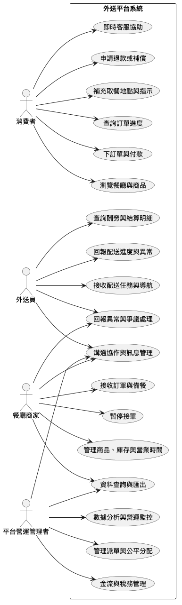

# 外送平台系統 軟體需求規格書

## 系統目的

本系統旨在建立一個多角色（消費者、外送員、餐廳商家、平台營運管理者）共用的外送平台，協助各方高效、透明且合規地完成訂單處理、付款、配送、溝通協作與爭議處理，並確保金流結算、資訊揭露及資料保存皆符合法規要求，以提升服務體驗、保障權益並降低營運與法遵風險。

## 系統範圍

- 提供消費者、外送員、餐廳商家及平台營運管理者使用的外送平台系統，涵蓋訂單處理、付款、配送進度查詢、即時協助與爭議處理等主要流程。
- 支援多角色（消費者、外送員、餐廳商家、平台營運管理者）之操作介面與資訊呈現，並確保各角色可取得其所需之功能與資訊。
- 管理與同步訂單、商品、庫存、營業時間、配送資訊及相關費用，並確保資料正確性與透明度。
- 提供金流結算、酬勞與撥款管理，並符合法規要求之稅務與合規作業。
- 支援平台內部與外部（如商家、外送員、消費者）之溝通協作與爭議處理機制。

## 系統情境

此情境圖用來釐清外送平台系統的邊界，明確呈現消費者、外送員、餐廳商家與平台營運管理者等主要外部角色，以及與第三方支付/金流服務的互動，並標示各角色與系統間的主要資料流、事件流與責任分工。

## 系統限制

1. 系統介面必須明確揭示所有商品價格、各項服務費與運費，並完整列出各種取消訂單之理由及對應退費機制，不得有未公開的額外費用，並需符合地方法規與主管機關規定。 [[DR]](./design_rationale.html#con-1)
2. 平台處理金流及稅務等相關作業時，必須遵守所有適用法規（含第三方支付、消費者保護、個資及稅務法等），並具備自動保存、查核與稽核機制，以確保所有交易、退款、酬勞結算及相關資料均可供主管機關稽查且保存期限不低於兩年。 [[DR]](./design_rationale.html#con-2)
3. 系統必須依據適用法規及各國商業合約要求，保存所有金流與交易原始資料於法定年限內（不得短於二年），並確保於稽核、查核或調查時，所有原始紀錄可立即調閱且無法被任意修改或刪除。 [[DR]](./design_rationale.html#con-3)
4. 當消費者指定非住家、特殊或高風險地點（如公司、超商、公共空間）作為取餐地點時，平台必須於下單過程明確揭露進出限制、風險與權利義務，必要時要求用戶確認條款、進出說明或提供聯絡協助，對於高風險或特殊場所應依主管機關規定留存消費者同意證據及進出權資訊，以備法規查核。 [[DR]](./design_rationale.html#con-4)
5. 當消費者於下單流程指定特殊取餐地點（如校園、醫院、商辦大樓等），平台必須明確揭露該地點進出限制、現場規範、隱私政策、風險與責任條款，並於訂單成立前取得消費者同意。必要時，應提示消費者補充臨時聯絡人或門禁資訊。所有用戶同意、聯絡及配送進出紀錄，須依主管機關規定保存至少二年，於查核或爭議時應能出具完整證明資料。 [[DR]](./design_rationale.html#con-5)
6. 所有賠償申請、處理回報、審查紀錄、補償決策及決策依據等資料，應保存不少於二年，並於主管機關、權益人查詢、稽核或調查時可供即時查調。 [[DR]](./design_rationale.html#con-6)

## 需求

### 功能性需求

#### FR-1: 訂單流程簡化與透明 [[DR]](./design_rationale.html#fr-1)
**Description**: 系統應設計簡單明瞭的選餐、付款及訂單進度查詢流程，讓使用者能以最少步驟完成操作，且於各環節提供清楚指示與相關資訊，提升消費者操作意願與便利性。

**Priority**: must

**Acceptance Criteria**:

1. 消費者可於30秒內完成點餐至下單流程，不需重複填入相同資訊。
2. 訂單進度查詢介面包含餐點準備、外送員取餐、配送中、即將送達等明確狀態標示。
3. 所有操作介面有明顯且易懂的指示（如按鈕名稱、提示訊息），無操作死角。

#### FR-2: 即時協助與便捷退款處理 [[DR]](./design_rationale.html#fr-2)
**Description**: 系統應於消費者遇到出餐延遲、外送員服務不佳等問題時，提供即時線上協助通道與一站式退款申請流程，並於合理時間內完成退款處理及回復查詢。

**Priority**: must

**Acceptance Criteria**:

1. 消費者可於訂單詳細頁直接發起即時協助（如線上客服、智能回復）。
2. 消費者可於三分鐘內完成退款申請，平台需於規定期限（如3個工作天內）完成初步處理及回覆。
3. 系統自動保留協助及退款申請紀錄，供雙方查詢。

#### FR-3: 訂單異常補償與審查流程 [[DR]](./design_rationale.html#fr-3)
**Description**: 當訂單配送過程中發生餐點傾倒、送錯、餐點變冷等異常時，系統須提供消費者在事件發生後三分鐘內於平台回報的入口，並於回報後兩步驟內完成補償申請。平台應自動根據事件類型推算可申請的補償方式及標準，明確揭示補償種類與金額依據。平台需於三日內完成補償審查、核定並通知消費者，任何被拒絕或延遲處理皆須具體說明。補償審查過程應允許雙方補充舉證或說明，並不得單方面接受任一方主張。全程相關資料（申請、決策、證據、結果）需保存不少於兩年。

**Priority**: must

**Acceptance Criteria**:

1. 消費者可於訂單異常事件發生後三分鐘內於平台完成回報。
2. 平台自動依異常事件類型推算並揭示各種補償方式與金額計算依據。
3. 消費者可於兩步驟內申請補償與案件說明。
4. 三日內完成審查、核定補償及申請處理結果通知，若駁回或延遲必須有明確說明。
5. 補償審查過程雙方皆可補充舉證或說明，不得僅單方認定。
6. 所有補償、申請、決策依據、相關資料需保存不少於二年。

#### FR-4: 外送訂單預計送達時間查詢 [[DR]](./design_rationale.html#fr-4)
**Description**: 系統應於訂單成立後即時顯示預計送達時間於消費者介面，並根據配送進度自動更新此時間，協助消費者掌握外送狀態並決定是否使用平台服務。

**Priority**: must

**Acceptance Criteria**:

1. 訂單成立後即刻於消費者查詢頁顯示預計送達時間。
2. 送達時間根據外送進度動態更新（如交通、天氣、異常事件等）且更新頻率明確（如每3分鐘一次）。
3. 消費者可隨時查詢歷史及即時的送達預估紀錄，且介面標示清晰。

#### FR-5: 地圖導航、取餐與配送流程支持 [[DR]](./design_rationale.html#fr-5)
**Description**: 當外送員前往餐廳或消費者地點進行取餐與配送時，系統應於同一頁面整合顯示地圖導航、取餐指示及相關配送資訊，並根據訂單狀態自動更新目的地及指示。未授權或無法進入場所時，系統應顯示聯絡資料協助外送員處理現場障礙。

**Priority**: must

**Acceptance Criteria**:

1. 外送員可於一個頁面內同時查詢導航路線、取餐指示、配送資訊及可用聯絡方式。
2. 導航指南須與訂單狀態聯動，自動調整目的地並顯示異常情境提示。
3. 導航錯誤（如導至錯誤地點）、取餐/配送指示顯示錯誤或關鍵資訊遺漏之訂單比例低於1%（以日均計算）。

#### FR-6: 爭議處理與外送員保護機制 [[DR]](./design_rationale.html#fr-6)
**Description**: 系統應提供外送員針對惡意投訴或出餐延遲等爭議事件，快速提交申訴或說明之途徑，並於爭議處理過程中設計適當保護措施，以避免誤判及平台對外送員不公平待遇。

**Priority**: must

**Acceptance Criteria**:

1. 外送員可於每次涉及爭議的訂單詳情頁，在3步驟內提交異議。
2. 系統於受理爭議時，暫時凍結相關懲處，待調查完成後再執行。
3. 每筆爭議案件均有處理紀錄供日後稽核與外送員查詢。

#### FR-7: 酬勞結算與正確度管理 [[DR]](./design_rationale.html#fr-7)
**Description**: 系統應依約定週期自動結算外送員酬勞，並確保結算明細、扣款、錯誤修正流程透明，讓外送員可隨時查詢酬勞記錄與明細，避免漏發、誤扣與異常狀況。

**Priority**: must

**Acceptance Criteria**:

1. 外送員可於結算日當天查看當期酬勞明細與異常狀況說明。
2. 任何扣款項目需有明確說明與下方申訴機制連結。
3. 系統每月主動核對訂單與酬勞記錄，發現異常自動推播通知外送員。

#### FR-8: 訂單派送公平性 [[DR]](./design_rationale.html#fr-8)
**Description**: 當外送員回報配送過程中的異常（如備餐延遲、餐廳未營業等）時，系統所採用的訂單派送演算法不得自動減少該外送員可分配到的訂單量，除非經過明確的人為審查決策並留有決策紀錄。任何因異常上報、服務評分或歷史紀錄等因素影響派單結果者，必須具備決策證據與完整查詢紀錄，平台需提供外送員查詢歷史派單情形及申訴管道。平台每週應自動產生派單分配統計報表供主管查核，當發現長期極端分配現象時，系統需自動產生異常提示以供人工審查。

**Priority**: must

**Acceptance Criteria**:

1. 平台每週自動產出派單分配統計報表供主管查核。
2. 若發現演算法造成長期極端分配現象，系統自動產生異常提示並供人工審查介入。
3. 所有因異常上報、評分或紀錄而減少派單者，須具有人為審查決策及留存紀錄。
4. 外送員可查閱個人歷史派單分配情況，若有爭議可發起申訴並取得處理結果說明。

#### FR-9: 營運即時數據監控與異常分析 [[DR]](./design_rationale.html#fr-9)
**Description**: 平台應提供營運管理者即時查詢分析平台數據（如訂單流量、營收、異常事件等）之能力，以支援行銷調整、緊急問題處理與經營決策，並具備異常自動告警與可追溯分析功能。

**Priority**: must

**Acceptance Criteria**:

1. 主管可透過專屬介面隨時查詢最新訂單流量、營收及過去30天內異常記錄。
2. 系統於訂單流量或金流異常（如超標、驟降）時能於3分鐘內自動通知管理者。
3. 所有數據異常紀錄具備完整追溯來源與查詢時間戳記。

#### FR-10: 多方溝通協作渠道 [[DR]](./design_rationale.html#fr-10)
**Description**: 平台應支援有效且順暢的溝通機制，讓營運管理者能與商家、外送員互動協調，處理平台營運相關議題，並能即時將重要訊息訊息推送給指定對象，避免因溝通不暢導致問題積壓及客服壓力增加。

**Priority**: must

**Acceptance Criteria**:

1. 管理者可一站式查閱並回覆外送員或商家來訊，支持主題分類與訊息查詢。
2. 平台支援雙向訊息推播機制（如公告、警示），訊息到達率達98%以上。
3. 所有溝通記錄及處理結果可追溯、具查詢與導出功能。

#### FR-11: 後台介面簡化與訂單資訊自動同步 [[DR]](./design_rationale.html#fr-11)
**Description**: 當餐廳商家人員管理訂單時，系統應提供簡單易用的後台介面，並自動同步訂單資訊、庫存狀態及營業時間，確保所見資訊為最新狀態，以降低操作複雜性與錯誤風險。

**Priority**: must

**Acceptance Criteria**:

1. 商家可於一個頁面查看所有訂單資訊、庫存現況及營業時間。
2. 每次訂單更新（如新訂單、取消、完成）後，庫存與營業時間自動同步至後台，不需手動重載頁面。
3. 使用流程不超過三個步驟即可完成訂單管理主要操作。
4. 操作介面標示明確，誤操作比例明顯下降（如錯誤訂單量較過去降低至少20%）。

#### FR-12: 訂單責任歸屬釐清與爭議協作 [[DR]](./design_rationale.html#fr-12)
**Description**: 當發生消費者投訴或外送員遲到等爭議事件時，系統應協助餐廳商家查詢相關訂單資料、歷程紀錄及推導事件責任歸屬，並提供申訴或協同處理通道，以避免商家單方面承擔無法判斷的損失。

**Priority**: must

**Acceptance Criteria**:

1. 商家可在爭議訂單詳情頁查看所有關鍵紀錄（下單、出餐、分派、遲到紀錄等）。
2. 系統依流程自動標示暫時歸責判斷（如消費者、商家、外送員責任）。
3. 提供線上提交補充證據與申訴的功能，並有平台管理人員後續介入處理機制。
4. 所有舉證與溝通記錄可供日後查證。

#### FR-13: 結算撥款準時與明細透明 [[DR]](./design_rationale.html#fr-13)
**Description**: 系統應準時完成餐廳商家之結算撥款，並於後台明確揭示結算明細、計算方式及扣款理由，保證資訊完整透明，避免無預警扣款或結帳延遲。

**Priority**: must

**Acceptance Criteria**:

1. 商家可在每結算週期結束當天於後台查詢當期結算明細、收入及扣款說明。
2. 自動推播提醒商家結算結果，遇異常能查詢相關理由與紀錄。
3. 所有結算與撥款紀錄保存不少於兩年，並可匯出查證。

#### FR-14: 即時暫停接單與訂單處理 [[DR]](./design_rationale.html#fr-14)
**Description**: 當餐廳出現食材短缺或臨時公休等狀況時，系統應允許商家即時在後台暫停接單，並自動通知消費者及調整外送員派單，以避免產生無法履約的訂單。

**Priority**: must

**Acceptance Criteria**:

1. 商家可隨時於後台一鍵啟用及解除暫停接單功能，操作完成後即時生效。
2. 平台自動於前台標示商家暫停狀態，並停止所有新訂單派單流程。
3. 因暫停接單造成的未完成訂單自動退單處理且消費者取得即時通知。

#### FR-15: 彈性取餐地點與指示資訊管理 [[DR]](./design_rationale.html#fr-15)
**Description**: 系統應允許消費者於每筆訂餐流程中，自由選擇取餐地點與接收方式，包括住家、公司、超商、公共空間等場域，並可在平台介面補充取餐相關指示或注意事項（如備註、特殊交付需求等），所有資訊須確實同步給外送員並於外送員操作介面即時顯示，協助外送員正確履行交付任務。

**Priority**: must

**Acceptance Criteria**:

1. 消費者於下單流程可從多種取餐地點與取餐方式中彈性選擇，並可於同一介面輸入特殊指示。
2. 外送員操作介面可完整顯示消費者補充的取餐資訊與注意事項。
3. 平台自動紀錄每筆訂單取餐地點及交付指示內容，並可追溯查詢。

#### FR-16: 取餐方式明確告知與同意機制 [[DR]](./design_rationale.html#fr-16)
**Description**: 系統於消費者設定或變更取餐方式及取餐地點時，應以明確介面揭示每種選項資訊、適用條件及可能限制，並於消費者確認頁明確取得用戶同意，嚴禁系統自動決定或變更取餐方式而未經消費者明確同意。

**Priority**: must

**Acceptance Criteria**:

1. 消費者變更或設定取餐方式時，系統顯示所有可選項目、條件、風險說明及需明確勾選同意。
2. 系統不得在未經消費者操作或同意下自動變更其既有取餐方式。
3. 所有取餐方式設定、同意紀錄需留存至少二年，並可供稽核查詢。

#### FR-17: 金流與交易資料格式化匯出支援 [[DR]](./design_rationale.html#fr-17)
**Description**: 系統應支援營運管理者查詢、篩選及依需求以審查用途格式（如CSV、PDF或API）匯出所有金流與交易資料，並於匯出資料中保留必要的完整性、真實性與原始紀錄資訊，以利營運管理、稽核及法務查證。

**Priority**: must

**Acceptance Criteria**:

1. 平台管理人員可按時間區間、資料類型查詢並下載或調用API取得金流與交易相關資料。
2. 匯出資料格式至少支援CSV、PDF與標準API，保留原始記錄欄位及時戳。
3. 所有匯出或存取行為有操作紀錄留存，不得影響原始資料不可竄改性。

#### FR-18: 異常上報處理與派單保障 [[DR]](./design_rationale.html#fr-18)
**Description**: 當外送員於配送過程遇到餐廳未營業、備餐延遲或其他異常時，系統應允許外送員於操作界面兩步驟內快速上報，並即時顯示後續標準處理流程或補償及釐清指引。異常上報行為不得自動導致該名外送員後續訂單量減少或其他不利調度行為，所有因異常上報造成派單異動者，必須經過人工審查與決策紀錄，並供外送員查詢所有異常上報紀錄及對其派單的實際影響。相關派單與異常上報決策須符合法定公平原則與資料查核要求。

**Priority**: must

**Acceptance Criteria**:

1. 外送員可於訂單操作界面在兩步驟內完成異常事件回報。
2. 系統於回報後即時顯示後續標準處理流程、補償或釐清指引。
3. 異常上報不得自動導致該外送員派單量被減少，必要時須經人工審查並留存審查決策紀錄。
4. 外送員可查詢個人所有異常上報紀錄及其對派單的實際影響。

#### FR-19: 特殊取餐指示同步與資訊顯示 [[DR]](./design_rationale.html#fr-19)
**Description**: 當消費者於訂單流程補充或變更取餐地點、接收方式、特殊指示時，系統應於消費者端即時顯示外送員閱讀與確認狀態，並於外送員端各關鍵節點（接單後、前往目的地、配送前）明顯顯示所有有效指示與變更內容，不得隱藏於多層頁面或選單，協助外送員正確執行配送。

**Priority**: must

**Acceptance Criteria**:

1. 消費者於補充或變更指示後，平台介面即時顯示外送員已讀與確認狀態。
2. 外送員端於接單及配送關鍵節點均能明顯查看所有有效指示及臨時變更內容。
3. 所有特殊指示、留言、臨時變更內容不得隱藏於多層選單或次要頁面。
4. 特殊指示閱讀及確認情形有紀錄，並可於事後查詢。
5. 任一有效指示未於關鍵節點主動顯示的情形，每日不得超過1%（以日均訂單計）。

#### FR-20: 異常處理與流程協助 [[DR]](./design_rationale.html#fr-20)
**Description**: 當外送員資訊未確認、未依指示執行或因現場原因無法配合時，系統應允許外送員於2步驟內快速回報異常，平台於30秒內同步通知消費者並開啟即時協助介面，並於回報時提供異常說明機制及處理進度查詢。

**Priority**: must

**Acceptance Criteria**:

1. 外送員於資訊未確認、未依指示或遇現場障礙時，2步驟內可回報異常。
2. 平台於異常回報後30秒內同步通知消費者並顯示協助入口。
3. 外送員可填寫原因，異常回報及進度有完整紀錄可查詢。
4. 相關異常處理紀錄保存不少於二年。

### 非功能性需求

#### NFR-1: 系統效能與資訊正確性 [[DR]](./design_rationale.html#nfr-1)
**Description**: 系統應維持高效的回應速度與處理能力，並確保訂單、導航及關鍵資訊的正確性和時效性，避免因為錯誤或延遲影響外送員執行訂單。此品質要求應涵蓋操作介面、地圖、報酬資料等主要系統交易範圍。

**Category**: performance, reliability, accuracy

**Metric**: 平均操作回應時間小於2秒；外送員每千筆訂單關鍵資訊錯誤次數不得超過1筆。

**Validation**: 日常自動監控操作速度，透過測試帳號進行批次資料正確性抽查，每月審查回應時間和錯誤通報率。

#### NFR-2: 系統穩定性與可靠性 [[DR]](./design_rationale.html#nfr-2)
**Description**: 系統在日常營運、維運作業及高併發情境下，必須維持穩定運作，避免頻繁當機、錯誤或服務中斷，以確保用戶得以持續使用服務且不因系統異常中斷主要業務流程。

**Category**: reliability, availability

**Metric**: 全年平均系統可用率不低於99.9%；重大當機或無法完成主要業務功能之事件每月不得超過1次。

**Validation**: 定期自動化監控系統可用率與異常日誌，並每月審核營運紀錄、事故回報件數與平均回復時間。

#### NFR-3: 平台功能與費用平衡性 [[DR]](./design_rationale.html#nfr-3)
**Description**: 系統整體設計須兼顧吸引消費者、保障外送員權益及維持平台營收三方利益間的平衡，避免任一方因費用規劃失衡而影響服務持續性與合作意願。

**Category**: usability, maintainability, economic efficiency

**Metric**: 消費者回饋因費用問題導致流失率、外送員流失率、平均平台毛利率，三者不因費用調整產生20%以上偏離基準。

**Validation**: 每季審查平台財務指標、用戶（消費者/外送員）滿意度及流失率變化，並同步追蹤服務持續性。

#### NFR-4: 手續費合理性與商家合作維持 [[DR]](./design_rationale.html#nfr-4)
**Description**: 平台向餐廳商家收取之手續費需維持在產業合理範圍，確保商家於薄利多銷情境下仍有盈餘，並不因費率異動大幅影響持續上架意願。

**Category**: economic efficiency, maintainability

**Metric**: 手續費率應參考同業水平，且平台定期檢查合作商家流失率與利潤偏離度（如平均平台手續費±10%不得造成商家流失率上升逾20%）。

**Validation**: 每半年檢核業界費率、商家合作持續率及相關財務數據，必要時啟動調整評估機制。

#### NFR-5: 操作流程不受提醒干擾 [[DR]](./design_rationale.html#nfr-5)
**Description**: 系統所有提醒功能應設計於不妨礙外送員主要操作流程（如導航、問題回報、收款等），避免因提醒訊息導致操作誤觸、中斷或延遲任務進行；重要提醒須以適當方式疊加、不覆蓋主要功能按鈕或行動路徑。

**Category**: usability

**Metric**: 因提醒訊息導致誤觸或流程中斷的外送員申訴或系統異常個案，單日不得超過0.1%之訂單數。

**Validation**: 定期分析系統行為日誌及異常回報原因，輔以外送員用戶訪談及投訴數據進行交叉驗證。

## 附錄

### A. 系統模型
#### SM-2: 外送平台主要角色用例圖

#### 1. 消費者

| UC ID | Use Case | Purpose | Interface | Related Requirement |
|---|---|---|---|---|
| UC1 | 瀏覽餐廳與商品 | 消費者可於平台上瀏覽可訂購的餐廳與商品資訊，了解菜單、價格、營業時間等內容。 | 餐廳列表頁、餐廳詳細頁、商品（菜單）瀏覽頁 | URL-1, URL-3 |
| UC2 | 下訂單與付款 | 消費者選擇商品後可建立訂單並完成付款，系統需揭露所有費用並支援多元支付方式。 | 購物車頁、訂單確認頁、付款流程頁、費用明細揭露區 | URL-1, URL-22, URL-3 |
| UC3 | 查詢訂單進度 | 消費者可即時查詢訂單處理、備餐、配送等進度及預計送達時間。 | 訂單進度查詢頁、訂單詳情頁 | URL-1, URL-5 |
| UC4 | 補充取餐地點與指示 | 消費者可於下單時或訂單成立後補充取餐地點、接收方式及特殊指示，並確認外送員已讀取。 | 取餐地點設定頁、訂單備註／指示填寫區、指示已讀回饋區 | URL-21, URL-22, URL-26 |
| UC5 | 申請退款或補償 | 消費者於訂單異常、配送問題或服務不佳時可申請退款或補償，並選擇補償方式。 | 訂單問題申請頁、退款／補償申請流程頁、補償方式選擇區 | URL-2, URL-34, URL-4 |
| UC6 | 即時客服協助 | 消費者於訂單過程中遇到問題時可即時聯繫客服，獲得協助與處理進度回饋。 | 客服聯繫頁、即時對話／留言區 | URL-2, URL-35 |

#### 2. 餐廳商家

| UC ID | Use Case | Purpose | Interface | Related Requirement |
|---|---|---|---|---|
| UC7 | 接收訂單與備餐 | 餐廳商家接收新訂單並依據訂單內容備餐，更新訂單狀態。 | 訂單接收頁、訂單詳情頁、備餐進度管理頁 | URL-16 |
| UC8 | 管理商品、庫存與營業時間 | 餐廳商家可管理菜單商品、調整庫存數量及設定營業時間，確保資訊同步。 | 商品管理頁、庫存管理頁、營業時間設定頁 | URL-16 |
| UC9 | 暫停接單 | 餐廳商家可因臨時公休或食材短缺等原因，暫停接單以避免無法完成訂單。 | 接單狀態設定頁 | URL-20 |

#### 3. 餐廳商家、外送員

| UC ID | Use Case | Purpose | Interface | Related Requirement |
|---|---|---|---|---|
| UC10 | 回報異常與爭議處理 | 餐廳商家或外送員可針對訂單異常（如備餐延遲、配送問題）進行回報，並啟動爭議處理流程。 | 外送員配送任務頁、配送狀態回報頁、異常回報頁 | URL-17, URL-25, URL-37 |

#### 4. 外送員

| UC ID | Use Case | Purpose | Interface | Related Requirement |
|---|---|---|---|---|
| UC11 | 接收配送任務與導航 | 外送員接收新配送任務，取得取餐與送餐地點資訊，並可使用導航功能。 | 配送任務列表頁、任務詳情頁、地圖導航頁 | URL-6, URL-8 |
| UC12 | 回報配送進度與異常 | 外送員於配送過程中可回報進度、異常狀況或現場問題，並獲得處理指引。 | 外送員配送任務頁、配送狀態回報頁、異常回報頁 | URL-25, URL-28, URL-31, URL-32, URL-33 |
| UC13 | 查詢酬勞與結算明細 | 外送員可查詢歷史酬勞、結算明細及撥款狀態，確保收入透明。 | 酬勞查詢頁、結算明細頁 | URL-9 |

#### 5. 平台營運管理者

| UC ID | Use Case | Purpose | Interface | Related Requirement |
|---|---|---|---|---|
| UC14 | 管理派單與公平分配 | 平台營運管理者可設定與監控訂單派發規則，確保派單公平並處理異常分配。 | 派單規則設定頁、派單監控頁、異常分配查詢頁 | URL-10 |
| UC15 | 數據分析與營運監控 | 平台營運管理者可即時查看訂單流量、營收、異常狀況等數據，支援營運決策。 | 數據儀表板、營運監控頁、異常狀況分析頁 | URL-11, URL-12 |
| UC16 | 金流與稅務管理 | 平台營運管理者可管理金流結算、稅務作業，並確保符合法規要求。 | 金流管理頁、稅務管理頁、結算紀錄查詢頁 | URL-14, URL-18, URL-23 |

#### 6. 餐廳商家、外送員、平台營運管理者

| UC ID | Use Case | Purpose | Interface | Related Requirement |
|---|---|---|---|---|
| UC17 | 溝通協作與訊息管理 | 多方角色可於平台內進行訊息溝通、協作與重要通知管理，提升協作效率。 | 訊息中心頁、協作通知頁 | URL-13 |

#### 7. 餐廳商家、平台營運管理者

| UC ID | Use Case | Purpose | Interface | Related Requirement |
|---|---|---|---|---|
| UC18 | 資料查詢與匯出 | 餐廳商家與平台營運管理者可查詢、匯出訂單、金流、交易等資料，支援稽核與管理。 | 資料查詢頁、資料匯出頁 | URL-18, URL-23, URL-24 |
